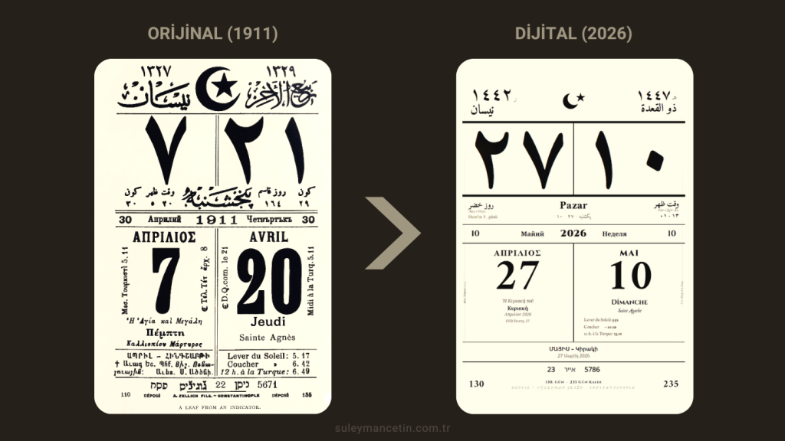

<div align="center">
  
</div>

<div align="center">
  <a href="https://suleymancetinx.github.io/Zellich-Codex-Ottoman-Multilingual-Chronos/" target="_blank">
    
  </a>
</div>

# 📅 Ottoman Multilingual Calender

Bu çalışma, 19. yüzyıl İstanbul'unun estetik ve kozmopolit mirasını, matbaacılık sanatının öncü ismi **Zellich Ailesi**'nin gözünden dijital dünyaya taşımaktadır.

---


## 📖 Bir Mirasın Anatomisi: Zellich Ailesi ve 1869'dan Günümüze
Zellich ailesi, 1840'ta Dalmaçya'dan İstanbul'a yerleşerek Osmanlı İmparatorluğu'nda grafik sanatlarının öncüsü olmuştur. Antonio Zellich tarafından **1869** yılında kurulan **"A. Zellich Fils"** matbaası, bugün koleksiyonerlerin nadide parçalarından olan "saatli maarif" tarzı çok dilli takvimlerin mimarıdır. 

Zellichler, sadece birer matbaacı değil; imparatorluğun kozmopolit yapısını, farklı inanç ve zaman algılarını tek bir kağıt üzerinde birleştiren vizyoner tasarımcılardır. Bu proje, matbaanın en olgun eserlerini verdiği 1900'lerin başındaki takvim yapraklarını temel almaktadır.

## 💡 Projenin Fikri ve Amacı
Bu proje, kökeni 19. yüzyıla dayanan orijinal bir Zellich takvim yaprağının günümüz verileriyle dijital olarak yeniden hayat bulmasıdır.

**Neden Çok Dilli?** Osmanlı'nın son dönemindeki sosyal yapıda; Müslüman, Rum, Ermeni, Yahudi ve Levanten toplumların kendi zaman algılarını (Hicri, Rumi, Miladi) tek bir ortak düzlemde takip edebilmelerini sağlamak amacıyla tasarlanmıştır.

---

## ✨ Tasarım Özellikleri ve İçerik
Zamanın parçalı yapısını estetik bir bütünlükle sunan dijital Zellich yaprağı şu verileri içerir:

* 🏛️ **Resmiyet:** Osmanlı Devlet sembolleri eşliğinde Hicri ve Rumi takvim bilgileri.
* 🎯 **Odak:** Günün Miladi rakamı ve estetik Osmanlıca/Türkçe hat ile sunulan gün ismi.
* 🌍 **Çok Dilli Şerit:** Fransızca, Bulgarca, Yunanca, Ermenice ve İbranice tarih karşılıkları.
* 🌾 **Halk Takvimi:** Anadolu irfanına dayalı Ruz-ı Hızır (Yaz) ve Ruz-ı Kasım (Kış) döngüsü.
* ☀️ **Astronomi:** Vakt-i Zuhr (Öğle), Tulû (Güneşin Doğuşu) ve Gurûb (Güneşin Batışı) saatleri.
* 📜 **Telif:** Orijinal takvimlerde yer alan tescil ibaresi (**DÉPOSÉ**) aslına sadık kalınarak işlenmiştir.

---

## 🚀 Teknolojik Mimari
- **Frontend:** HTML5 ve yoğun CSS3 (19. yüzyıl matbaa estetiği ve kağıt dokusu üzerine kurgulandı).
- **Engine:** Vanilla JavaScript (ES6+) ile tarihsel zaman senkronizasyonu.
- **Erişilebilirlik:** Modern UX standartları ile tarihi dokunun harmanlanması.

---

> "Kültürel miras, sadece müzelerde saklanan değil, kod satırlarıyla yeniden hayat bulan bir değerdir."

**Geliştirici:** Süleyman Çetin

---

## 🎨 
```text
        _____       _                                
       / ____|     | |                               
      | (___  _   _| | ___ _   _ _ __ ___   __ _ _ __  
       \___ \| | | | |/ _ \ | | | '_ ` _ \ / _` | '_ \ 
       ____) | |_| | |  __/ |_| | | | | | | (_| | | | |
      |_____/ \__,_|_|\___|\__, |_| |_| |_|\__,_|_| |_|
                            __/ |                      
                           |___/
